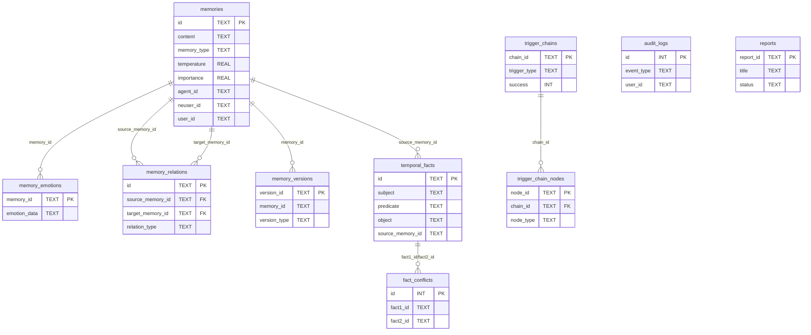

# Neurova 数据库图谱

> 生成时间：2026-08-14T11:29:06.239540 ｜ 数据库文件数：40 ｜ 代码建表定义：10

本文档是 `docs/database-schema.json` 的人类可读版本，作为编程时查询数据库结构的依据。

## 1. 数据库文件总览

| 文件 | 大小 | 表数 | 表名 |
|---|---|---|---|
| `neurova_memories_persist.db` | 67.92 MB | 1 | memories |
| `data/longmeval/memory.db` | 19.78 MB | 1 | dream_reports |
| `neurova_memory.db` | 2.54 MB | 1 | memory_emotions |
| `data/default/memory.db` | 0.25 MB | 1 | memories |
| `data/test_agent/memory.db` | 0.2 MB | 1 | attachments |
| `data/collaboration.db` | 0.17 MB | 1 | chat_groups |
| `data/users.db` | 0.09 MB | 1 | enhanced_users |
| `neurflow.db` | 0.07 MB | 1 | agents |
| `data/knowledge.db` | 0.05 MB | 1 | memory_knowledge_links |
| `data/11e01f4a/memory.db` | 0.05 MB | 1 | memories |
| `data/2ddec2e7/memory.db` | 0.05 MB | 1 | memories |
| `data/6612c134/memory.db` | 0.05 MB | 1 | memories |
| `data/71a0fa28/memory.db` | 0.05 MB | 1 | memories |
| `data/89f2fa2d/memory.db` | 0.05 MB | 1 | memories |
| `data/a8610259/memory.db` | 0.05 MB | 1 | memories |
| `data/agent_1/memory.db` | 0.05 MB | 1 | memories |
| `data/kai/memory.db` | 0.05 MB | 1 | memories |
| `data/test/memory.db` | 0.05 MB | 1 | memories |
| `data/test-001/memory.db` | 0.05 MB | 1 | memories |
| `data/test-fix/memory.db` | 0.05 MB | 1 | memories |
| `data/test-tools/memory.db` | 0.05 MB | 1 | memories |
| `data/test-tools2/memory.db` | 0.05 MB | 1 | memories |
| `data/test_001/memory.db` | 0.05 MB | 1 | memories |
| `data/test_agent/memory_tkg.db` | 0.05 MB | 1 | fact_relations |
| `data/yi_ling/memory.db` | 0.05 MB | 1 | memories |
| `data/experience_knowledge.db` | 0.04 MB | 1 | experience_records |
| `data/rbac.db` | 0.04 MB | 1 | permission_requests |
| `data/memory_links.db` | 0.04 MB | 1 | memory_links |
| `data/verification_codes.db` | 0.03 MB | 1 | register_rate_limits |
| `data/neurova_memories_persist.db` | 0.02 MB | 1 | memories |
| `data/qclaw_bindings.db` | 0.02 MB | 1 | qclaw_bindings |
| `data/test_memory.db` | 0.01 MB | 1 | memory_emotions |
| `data/test_memory_enhanced.db` | 0.01 MB | 1 | memory_emotions |

## 2. 全部表索引

| 表名 | 所在数据库 | 代码定义位置 |
|---|---|---|
| `agents` | `neurflow.db` | — |
| `attachments` | `data/test_agent/memory.db` | — |
| `chat_groups` | `data/collaboration.db` | — |
| `dream_reports` | `data/longmeval/memory.db` | `neurova/cognitive_layers/memory_layer/schema.py` |
| `enhanced_users` | `data/users.db` | — |
| `experience_records` | `data/experience_knowledge.db` | — |
| `fact_relations` | `data/test_agent/memory_tkg.db` | — |
| `memories` | `data/11e01f4a/memory.db`, `data/2ddec2e7/memory.db`, `data/6612c134/memory.db`, `data/71a0fa28/memory.db`, `data/89f2fa2d/memory.db`, `data/a8610259/memory.db`, `data/agent_1/memory.db`, `data/default/memory.db`, `data/kai/memory.db`, `data/neurova_memories_persist.db`, `data/test/memory.db`, `data/test-001/memory.db`, `data/test-fix/memory.db`, `data/test-tools/memory.db`, `data/test-tools2/memory.db`, `data/test_001/memory.db`, `data/yi_ling/memory.db`, `neurova_memories_persist.db` | `neurova/cognitive_layers/memory_layer/cognitive_storage_engine.py`, `neurova/cognitive_layers/memory_layer/schema.py` |
| `memory_emotions` | `data/test_memory.db`, `data/test_memory_enhanced.db`, `neurova_memory.db` | — |
| `memory_knowledge_links` | `data/knowledge.db` | — |
| `memory_links` | `data/memory_links.db` | — |
| `permission_requests` | `data/rbac.db` | — |
| `qclaw_bindings` | `data/qclaw_bindings.db` | — |
| `register_rate_limits` | `data/verification_codes.db` | — |

## 3. 外键关系（表间引用）

| 数据库 | 表 | 引用列 | → 目标表 | 目标列 | 删除策略 |
|---|---|---|---|---|---|
| `data/collaboration.db` | `chat_groups` | `project_id` | `projects` | `project_id` | CASCADE |
| `data/test_agent/memory.db` | `attachments` | `memory_id` | `memories` | `id` | SET NULL |

## 4. 核心表结构

### 4.1 `neurova_memories_persist.db` → `memories`（278173 行）

| 列 | 类型 | 主键 | 非空 | 默认值 |
|---|---|---|---|---|
| `id` | TEXT | ✅ |  | `None` |
| `content` | TEXT |  | ✅ | `None` |
| `memory_type` | TEXT |  | ✅ | `'semantic'` |
| `category` | TEXT |  | ✅ | `'general'` |
| `lifecycle_stage` | TEXT |  | ✅ | `'active'` |
| `perspective` | TEXT |  | ✅ | `'first_person'` |
| `emotion` | TEXT |  | ✅ | `'neutral'` |
| `temperature` | REAL |  | ✅ | `100.0` |
| `importance` | REAL |  | ✅ | `50.0` |
| `access_count` | INTEGER |  | ✅ | `0` |
| `metadata` | TEXT |  | ✅ | `'{}'` |
| `agent_id` | TEXT |  | ✅ | `'default'` |
| `neuser_id` | TEXT |  | ✅ | `'default'` |
| `user_id` | TEXT |  | ✅ | `'default'` |
| `shared` | INTEGER |  | ✅ | `0` |
| `created_at` | TEXT |  | ✅ | `None` |
| `updated_at` | TEXT |  | ✅ | `None` |
| `last_accessed_at` | TEXT |  |  | `None` |

索引：`idx_mem_type`(): memory_type

### 4.2 `data/longmeval/memory.db` → `dream_reports`（0 行）

| 列 | 类型 | 主键 | 非空 | 默认值 |
|---|---|---|---|---|
| `id` | TEXT | ✅ |  | `None` |
| `neuser_id` | TEXT |  | ✅ | `'default'` |
| `user_id` | TEXT |  | ✅ | `'default'` |
| `agent_id` | TEXT |  | ✅ | `'yi_ling'` |
| `session_id` | TEXT |  |  | `None` |
| `report_type` | TEXT |  | ✅ | `'sleep_consolidation'` |
| `total_processed` | INTEGER |  |  | `0` |
| `merged_count` | INTEGER |  |  | `0` |
| `archived_count` | INTEGER |  |  | `0` |
| `merged_details` | TEXT |  |  | `'[]'` |
| `archived_ids` | TEXT |  |  | `'[]'` |
| `consolidation_quality` | REAL |  |  | `0.0` |
| `emotional_intensity` | REAL |  |  | `0.0` |
| `memory_coherence_score` | REAL |  |  | `0.0` |
| `sleep_start_at` | TEXT |  |  | `None` |
| `sleep_end_at` | TEXT |  |  | `None` |
| `created_at` | TEXT |  |  | `CURRENT_TIMESTAMP` |
| `metadata` | TEXT |  |  | `'{}'` |

索引：`idx_dream_reports_neuser_user`(): neuser_id, user_id

### 4.3 `neurova_memory.db` → `memory_emotions`（11587 行）

| 列 | 类型 | 主键 | 非空 | 默认值 |
|---|---|---|---|---|
| `memory_id` | TEXT | ✅ |  | `None` |
| `emotion_data` | TEXT |  | ✅ | `None` |
| `created_at` | TIMESTAMP |  |  | `CURRENT_TIMESTAMP` |
| `updated_at` | TIMESTAMP |  |  | `CURRENT_TIMESTAMP` |

索引：`idx_memory_emotions_created_at`(): created_at

### 4.4 `data/default/memory.db` → `memories`（100 行）

| 列 | 类型 | 主键 | 非空 | 默认值 |
|---|---|---|---|---|
| `id` | TEXT | ✅ |  | `None` |
| `content` | TEXT |  | ✅ | `None` |
| `memory_type` | TEXT |  | ✅ | `None` |
| `category` | TEXT |  | ✅ | `'general'` |
| `temperature` | REAL |  | ✅ | `100.0` |
| `layer` | INTEGER |  | ✅ | `1` |
| `metadata` | TEXT |  |  | `'{}'` |
| `embedding` | TEXT |  |  | `None` |
| `created_at` | TEXT |  | ✅ | `None` |
| `updated_at` | TEXT |  | ✅ | `None` |
| `access_count` | INTEGER |  |  | `0` |
| `trace_id` | TEXT |  |  | `None` |

索引：`idx_cse_created_at`(): created_at

### 4.5 `data/test_agent/memory.db` → `attachments`（0 行）

| 列 | 类型 | 主键 | 非空 | 默认值 |
|---|---|---|---|---|
| `id` | TEXT | ✅ |  | `None` |
| `original_name` | TEXT |  | ✅ | `None` |
| `stored_name` | TEXT |  | ✅ | `None` |
| `file_path` | TEXT |  | ✅ | `None` |
| `file_size` | INTEGER |  | ✅ | `None` |
| `mime_type` | TEXT |  |  | `None` |
| `file_category` | TEXT |  |  | `None` |
| `content_hash` | TEXT |  |  | `None` |
| `memory_id` | TEXT |  |  | `None` |
| `metadata` | TEXT |  |  | `'{}'` |
| `created_at` | TEXT |  |  | `CURRENT_TIMESTAMP` |
| `updated_at` | TEXT |  |  | `CURRENT_TIMESTAMP` |

索引：`idx_attachments_created_at`(): created_at

### 4.6 `data/collaboration.db` → `chat_groups`（0 行）

| 列 | 类型 | 主键 | 非空 | 默认值 |
|---|---|---|---|---|
| `group_id` | TEXT | ✅ |  | `None` |
| `project_id` | TEXT |  | ✅ | `None` |
| `name` | TEXT |  | ✅ | `None` |
| `config` | TEXT |  |  | `'{}'` |
| `created_at` | TEXT |  |  | `CURRENT_TIMESTAMP` |
| `memory_id` | TEXT |  |  | `None` |

索引：`sqlite_autoindex_chat_groups_1`(唯一): group_id

### 4.7 `data/users.db` → `enhanced_users`（0 行）

| 列 | 类型 | 主键 | 非空 | 默认值 |
|---|---|---|---|---|
| `id` | INTEGER | ✅ |  | `None` |
| `username` | TEXT |  | ✅ | `None` |
| `password_hash` | TEXT |  | ✅ | `None` |
| `group_type` | TEXT |  | ✅ | `'user'` |
| `status` | TEXT |  | ✅ | `'active'` |
| `created_at` | TEXT |  | ✅ | `datetime('now')` |
| `updated_at` | TEXT |  | ✅ | `datetime('now')` |
| `last_login` | TEXT |  |  | `None` |
| `login_count` | INTEGER |  |  | `0` |
| `role` | TEXT |  |  | `NULL` |
| `language` | TEXT |  |  | `"zh-CN"` |
| `timezone` | TEXT |  |  | `"Asia/Shanghai"` |
| `theme` | TEXT |  |  | `"light"` |
| `notifications` | BOOLEAN |  |  | `1` |
| `last_active` | TEXT |  |  | `None` |
| `failed_attempts` | INTEGER |  |  | `0` |
| `locked_until` | TEXT |  |  | `None` |
| `reset_token` | TEXT |  |  | `None` |
| `reset_token_expires` | TEXT |  |  | `None` |
| `display_name` | TEXT |  |  | `None` |
| `avatar_url` | TEXT |  |  | `None` |
| `bio` | TEXT |  |  | `None` |
| `email` | TEXT |  |  | `None` |

索引：`idx_enhanced_users_email`(): email

### 4.8 `neurflow.db` → `agents`（0 行）

| 列 | 类型 | 主键 | 非空 | 默认值 |
|---|---|---|---|---|
| `agent_id` | TEXT | ✅ |  | `None` |
| `name` | TEXT |  | ✅ | `None` |
| `role` | TEXT |  | ✅ | `None` |
| `config_json` | TEXT |  |  | `'{}'` |
| `flow_id` | TEXT |  |  | `None` |
| `created_at` | REAL |  |  | `None` |
| `archived_at` | REAL |  |  | `None` |
| `status` | TEXT |  |  | `'active'` |
| `capabilities_json` | TEXT |  |  | `'[]'` |
| `metadata_json` | TEXT |  |  | `'{}'` |

索引：`idx_agents_status`(): status

### 4.9 `data/knowledge.db` → `memory_knowledge_links`（0 行）

| 列 | 类型 | 主键 | 非空 | 默认值 |
|---|---|---|---|---|
| `id` | INTEGER | ✅ |  | `None` |
| `user_id` | TEXT |  | ✅ | `None` |
| `memory_id` | TEXT |  | ✅ | `None` |
| `knowledge_id` | TEXT |  | ✅ | `None` |
| `knowledge_source` | TEXT |  | ✅ | `None` |
| `link_type` | TEXT |  |  | `'related'` |
| `confidence` | REAL |  |  | `1.0` |
| `metadata` | TEXT |  |  | `None` |
| `created_at` | TEXT |  | ✅ | `datetime('now')` |

索引：`idx_links_knowledge`(): knowledge_id, knowledge_source

### 4.10 `data/11e01f4a/memory.db` → `memories`（0 行）

| 列 | 类型 | 主键 | 非空 | 默认值 |
|---|---|---|---|---|
| `id` | TEXT | ✅ |  | `None` |
| `content` | TEXT |  | ✅ | `None` |
| `memory_type` | TEXT |  | ✅ | `None` |
| `category` | TEXT |  | ✅ | `'general'` |
| `temperature` | REAL |  | ✅ | `100.0` |
| `layer` | INTEGER |  | ✅ | `1` |
| `metadata` | TEXT |  |  | `'{}'` |
| `embedding` | TEXT |  |  | `None` |
| `created_at` | TEXT |  | ✅ | `None` |
| `updated_at` | TEXT |  | ✅ | `None` |
| `access_count` | INTEGER |  |  | `0` |
| `trace_id` | TEXT |  |  | `None` |

索引：`idx_cse_created_at`(): created_at

### 4.11 `data/2ddec2e7/memory.db` → `memories`（0 行）

| 列 | 类型 | 主键 | 非空 | 默认值 |
|---|---|---|---|---|
| `id` | TEXT | ✅ |  | `None` |
| `content` | TEXT |  | ✅ | `None` |
| `memory_type` | TEXT |  | ✅ | `None` |
| `category` | TEXT |  | ✅ | `'general'` |
| `temperature` | REAL |  | ✅ | `100.0` |
| `layer` | INTEGER |  | ✅ | `1` |
| `metadata` | TEXT |  |  | `'{}'` |
| `embedding` | TEXT |  |  | `None` |
| `created_at` | TEXT |  | ✅ | `None` |
| `updated_at` | TEXT |  | ✅ | `None` |
| `access_count` | INTEGER |  |  | `0` |
| `trace_id` | TEXT |  |  | `None` |

索引：`idx_cse_created_at`(): created_at

### 4.12 `data/6612c134/memory.db` → `memories`（0 行）

| 列 | 类型 | 主键 | 非空 | 默认值 |
|---|---|---|---|---|
| `id` | TEXT | ✅ |  | `None` |
| `content` | TEXT |  | ✅ | `None` |
| `memory_type` | TEXT |  | ✅ | `None` |
| `category` | TEXT |  | ✅ | `'general'` |
| `temperature` | REAL |  | ✅ | `100.0` |
| `layer` | INTEGER |  | ✅ | `1` |
| `metadata` | TEXT |  |  | `'{}'` |
| `embedding` | TEXT |  |  | `None` |
| `created_at` | TEXT |  | ✅ | `None` |
| `updated_at` | TEXT |  | ✅ | `None` |
| `access_count` | INTEGER |  |  | `0` |
| `trace_id` | TEXT |  |  | `None` |

索引：`idx_cse_created_at`(): created_at

### 4.13 `data/71a0fa28/memory.db` → `memories`（0 行）

| 列 | 类型 | 主键 | 非空 | 默认值 |
|---|---|---|---|---|
| `id` | TEXT | ✅ |  | `None` |
| `content` | TEXT |  | ✅ | `None` |
| `memory_type` | TEXT |  | ✅ | `None` |
| `category` | TEXT |  | ✅ | `'general'` |
| `temperature` | REAL |  | ✅ | `100.0` |
| `layer` | INTEGER |  | ✅ | `1` |
| `metadata` | TEXT |  |  | `'{}'` |
| `embedding` | TEXT |  |  | `None` |
| `created_at` | TEXT |  | ✅ | `None` |
| `updated_at` | TEXT |  | ✅ | `None` |
| `access_count` | INTEGER |  |  | `0` |
| `trace_id` | TEXT |  |  | `None` |

索引：`idx_cse_created_at`(): created_at

### 4.14 `data/89f2fa2d/memory.db` → `memories`（0 行）

| 列 | 类型 | 主键 | 非空 | 默认值 |
|---|---|---|---|---|
| `id` | TEXT | ✅ |  | `None` |
| `content` | TEXT |  | ✅ | `None` |
| `memory_type` | TEXT |  | ✅ | `None` |
| `category` | TEXT |  | ✅ | `'general'` |
| `temperature` | REAL |  | ✅ | `100.0` |
| `layer` | INTEGER |  | ✅ | `1` |
| `metadata` | TEXT |  |  | `'{}'` |
| `embedding` | TEXT |  |  | `None` |
| `created_at` | TEXT |  | ✅ | `None` |
| `updated_at` | TEXT |  | ✅ | `None` |
| `access_count` | INTEGER |  |  | `0` |
| `trace_id` | TEXT |  |  | `None` |

索引：`idx_cse_created_at`(): created_at

### 4.15 `data/a8610259/memory.db` → `memories`（0 行）

| 列 | 类型 | 主键 | 非空 | 默认值 |
|---|---|---|---|---|
| `id` | TEXT | ✅ |  | `None` |
| `content` | TEXT |  | ✅ | `None` |
| `memory_type` | TEXT |  | ✅ | `None` |
| `category` | TEXT |  | ✅ | `'general'` |
| `temperature` | REAL |  | ✅ | `100.0` |
| `layer` | INTEGER |  | ✅ | `1` |
| `metadata` | TEXT |  |  | `'{}'` |
| `embedding` | TEXT |  |  | `None` |
| `created_at` | TEXT |  | ✅ | `None` |
| `updated_at` | TEXT |  | ✅ | `None` |
| `access_count` | INTEGER |  |  | `0` |
| `trace_id` | TEXT |  |  | `None` |

索引：`idx_cse_created_at`(): created_at

### 4.16 `data/agent_1/memory.db` → `memories`（0 行）

| 列 | 类型 | 主键 | 非空 | 默认值 |
|---|---|---|---|---|
| `id` | TEXT | ✅ |  | `None` |
| `content` | TEXT |  | ✅ | `None` |
| `memory_type` | TEXT |  | ✅ | `None` |
| `category` | TEXT |  | ✅ | `'general'` |
| `temperature` | REAL |  | ✅ | `100.0` |
| `layer` | INTEGER |  | ✅ | `1` |
| `metadata` | TEXT |  |  | `'{}'` |
| `embedding` | TEXT |  |  | `None` |
| `created_at` | TEXT |  | ✅ | `None` |
| `updated_at` | TEXT |  | ✅ | `None` |
| `access_count` | INTEGER |  |  | `0` |
| `trace_id` | TEXT |  |  | `None` |

索引：`idx_cse_created_at`(): created_at

### 4.17 `data/kai/memory.db` → `memories`（0 行）

| 列 | 类型 | 主键 | 非空 | 默认值 |
|---|---|---|---|---|
| `id` | TEXT | ✅ |  | `None` |
| `content` | TEXT |  | ✅ | `None` |
| `memory_type` | TEXT |  | ✅ | `None` |
| `category` | TEXT |  | ✅ | `'general'` |
| `temperature` | REAL |  | ✅ | `100.0` |
| `layer` | INTEGER |  | ✅ | `1` |
| `metadata` | TEXT |  |  | `'{}'` |
| `embedding` | TEXT |  |  | `None` |
| `created_at` | TEXT |  | ✅ | `None` |
| `updated_at` | TEXT |  | ✅ | `None` |
| `access_count` | INTEGER |  |  | `0` |
| `trace_id` | TEXT |  |  | `None` |

索引：`idx_cse_created_at`(): created_at

### 4.18 `data/test/memory.db` → `memories`（0 行）

| 列 | 类型 | 主键 | 非空 | 默认值 |
|---|---|---|---|---|
| `id` | TEXT | ✅ |  | `None` |
| `content` | TEXT |  | ✅ | `None` |
| `memory_type` | TEXT |  | ✅ | `None` |
| `category` | TEXT |  | ✅ | `'general'` |
| `temperature` | REAL |  | ✅ | `100.0` |
| `layer` | INTEGER |  | ✅ | `1` |
| `metadata` | TEXT |  |  | `'{}'` |
| `embedding` | TEXT |  |  | `None` |
| `created_at` | TEXT |  | ✅ | `None` |
| `updated_at` | TEXT |  | ✅ | `None` |
| `access_count` | INTEGER |  |  | `0` |
| `trace_id` | TEXT |  |  | `None` |

索引：`idx_cse_created_at`(): created_at

### 4.19 `data/test-001/memory.db` → `memories`（0 行）

| 列 | 类型 | 主键 | 非空 | 默认值 |
|---|---|---|---|---|
| `id` | TEXT | ✅ |  | `None` |
| `content` | TEXT |  | ✅ | `None` |
| `memory_type` | TEXT |  | ✅ | `None` |
| `category` | TEXT |  | ✅ | `'general'` |
| `temperature` | REAL |  | ✅ | `100.0` |
| `layer` | INTEGER |  | ✅ | `1` |
| `metadata` | TEXT |  |  | `'{}'` |
| `embedding` | TEXT |  |  | `None` |
| `created_at` | TEXT |  | ✅ | `None` |
| `updated_at` | TEXT |  | ✅ | `None` |
| `access_count` | INTEGER |  |  | `0` |
| `trace_id` | TEXT |  |  | `None` |

索引：`idx_cse_created_at`(): created_at

### 4.20 `data/test-fix/memory.db` → `memories`（0 行）

| 列 | 类型 | 主键 | 非空 | 默认值 |
|---|---|---|---|---|
| `id` | TEXT | ✅ |  | `None` |
| `content` | TEXT |  | ✅ | `None` |
| `memory_type` | TEXT |  | ✅ | `None` |
| `category` | TEXT |  | ✅ | `'general'` |
| `temperature` | REAL |  | ✅ | `100.0` |
| `layer` | INTEGER |  | ✅ | `1` |
| `metadata` | TEXT |  |  | `'{}'` |
| `embedding` | TEXT |  |  | `None` |
| `created_at` | TEXT |  | ✅ | `None` |
| `updated_at` | TEXT |  | ✅ | `None` |
| `access_count` | INTEGER |  |  | `0` |
| `trace_id` | TEXT |  |  | `None` |

索引：`idx_cse_created_at`(): created_at

### 4.21 `data/test-tools/memory.db` → `memories`（0 行）

| 列 | 类型 | 主键 | 非空 | 默认值 |
|---|---|---|---|---|
| `id` | TEXT | ✅ |  | `None` |
| `content` | TEXT |  | ✅ | `None` |
| `memory_type` | TEXT |  | ✅ | `None` |
| `category` | TEXT |  | ✅ | `'general'` |
| `temperature` | REAL |  | ✅ | `100.0` |
| `layer` | INTEGER |  | ✅ | `1` |
| `metadata` | TEXT |  |  | `'{}'` |
| `embedding` | TEXT |  |  | `None` |
| `created_at` | TEXT |  | ✅ | `None` |
| `updated_at` | TEXT |  | ✅ | `None` |
| `access_count` | INTEGER |  |  | `0` |
| `trace_id` | TEXT |  |  | `None` |

索引：`idx_cse_created_at`(): created_at

### 4.22 `data/test-tools2/memory.db` → `memories`（0 行）

| 列 | 类型 | 主键 | 非空 | 默认值 |
|---|---|---|---|---|
| `id` | TEXT | ✅ |  | `None` |
| `content` | TEXT |  | ✅ | `None` |
| `memory_type` | TEXT |  | ✅ | `None` |
| `category` | TEXT |  | ✅ | `'general'` |
| `temperature` | REAL |  | ✅ | `100.0` |
| `layer` | INTEGER |  | ✅ | `1` |
| `metadata` | TEXT |  |  | `'{}'` |
| `embedding` | TEXT |  |  | `None` |
| `created_at` | TEXT |  | ✅ | `None` |
| `updated_at` | TEXT |  | ✅ | `None` |
| `access_count` | INTEGER |  |  | `0` |
| `trace_id` | TEXT |  |  | `None` |

索引：`idx_cse_created_at`(): created_at

### 4.23 `data/test_001/memory.db` → `memories`（0 行）

| 列 | 类型 | 主键 | 非空 | 默认值 |
|---|---|---|---|---|
| `id` | TEXT | ✅ |  | `None` |
| `content` | TEXT |  | ✅ | `None` |
| `memory_type` | TEXT |  | ✅ | `None` |
| `category` | TEXT |  | ✅ | `'general'` |
| `temperature` | REAL |  | ✅ | `100.0` |
| `layer` | INTEGER |  | ✅ | `1` |
| `metadata` | TEXT |  |  | `'{}'` |
| `embedding` | TEXT |  |  | `None` |
| `created_at` | TEXT |  | ✅ | `None` |
| `updated_at` | TEXT |  | ✅ | `None` |
| `access_count` | INTEGER |  |  | `0` |
| `trace_id` | TEXT |  |  | `None` |

索引：`idx_cse_created_at`(): created_at

### 4.24 `data/test_agent/memory_tkg.db` → `fact_relations`（0 行）

| 列 | 类型 | 主键 | 非空 | 默认值 |
|---|---|---|---|---|
| `id` | INTEGER | ✅ |  | `None` |
| `source_fact_id` | TEXT |  | ✅ | `None` |
| `target_fact_id` | TEXT |  | ✅ | `None` |
| `relation_type` | TEXT |  | ✅ | `None` |
| `created_at` | TEXT |  | ✅ | `None` |

索引：`idx_target_fact`(): target_fact_id

### 4.25 `data/yi_ling/memory.db` → `memories`（0 行）

| 列 | 类型 | 主键 | 非空 | 默认值 |
|---|---|---|---|---|
| `id` | TEXT | ✅ |  | `None` |
| `content` | TEXT |  | ✅ | `None` |
| `memory_type` | TEXT |  | ✅ | `None` |
| `category` | TEXT |  | ✅ | `'general'` |
| `temperature` | REAL |  | ✅ | `100.0` |
| `layer` | INTEGER |  | ✅ | `1` |
| `metadata` | TEXT |  |  | `'{}'` |
| `embedding` | TEXT |  |  | `None` |
| `created_at` | TEXT |  | ✅ | `None` |
| `updated_at` | TEXT |  | ✅ | `None` |
| `access_count` | INTEGER |  |  | `0` |
| `trace_id` | TEXT |  |  | `None` |

索引：`idx_cse_created_at`(): created_at

### 4.26 `data/experience_knowledge.db` → `experience_records`（8 行）

| 列 | 类型 | 主键 | 非空 | 默认值 |
|---|---|---|---|---|
| `id` | INTEGER | ✅ |  | `None` |
| `skill_name` | TEXT |  | ✅ | `None` |
| `context` | TEXT |  | ✅ | `None` |
| `result` | TEXT |  |  | `None` |
| `success` | INTEGER |  | ✅ | `None` |
| `timestamp` | TEXT |  | ✅ | `None` |
| `feedback` | TEXT |  |  | `None` |
| `agent_id` | TEXT |  |  | `None` |
| `session_id` | TEXT |  |  | `None` |
| `execution_time` | REAL |  |  | `None` |
| `confidence_score` | REAL |  |  | `None` |
| `tags` | TEXT |  |  | `None` |
| `created_at` | TEXT |  |  | `CURRENT_TIMESTAMP` |

索引：`idx_success`(): success

### 4.27 `data/rbac.db` → `permission_requests`（0 行）

| 列 | 类型 | 主键 | 非空 | 默认值 |
|---|---|---|---|---|
| `id` | INTEGER | ✅ |  | `None` |
| `requester_id` | TEXT |  | ✅ | `None` |
| `target_user_id` | TEXT |  | ✅ | `None` |
| `action` | TEXT |  | ✅ | `None` |
| `role_id` | TEXT |  |  | `None` |
| `permissions` | TEXT |  |  | `None` |
| `reason` | TEXT |  | ✅ | `None` |
| `status` | TEXT |  |  | `'pending'` |
| `approver_id` | TEXT |  |  | `None` |
| `approver_comment` | TEXT |  |  | `None` |
| `created_at` | TEXT |  | ✅ | `None` |
| `processed_at` | TEXT |  |  | `None` |

索引：`idx_permission_requests_status`(): status

### 4.28 `data/memory_links.db` → `memory_links`（1 行）

| 列 | 类型 | 主键 | 非空 | 默认值 |
|---|---|---|---|---|
| `link_id` | TEXT | ✅ |  | `None` |
| `memory_id` | TEXT |  | ✅ | `None` |
| `entity_type` | TEXT |  | ✅ | `None` |
| `entity_id` | TEXT |  | ✅ | `None` |
| `link_type` | TEXT |  |  | `'related'` |
| `created_at` | TEXT |  |  | `CURRENT_TIMESTAMP` |
| `created_by` | TEXT |  |  | `None` |

索引：`idx_memory_links_entity`(): entity_type, entity_id

### 4.29 `data/verification_codes.db` → `register_rate_limits`（5 行）

| 列 | 类型 | 主键 | 非空 | 默认值 |
|---|---|---|---|---|
| `id` | INTEGER | ✅ |  | `None` |
| `ip_address` | TEXT |  | ✅ | `None` |
| `attempted_at` | REAL |  | ✅ | `None` |
| `success` | BOOLEAN |  | ✅ | `0` |

索引：`idx_register_rate_limits_ip`(): ip_address

### 4.30 `data/neurova_memories_persist.db` → `memories`（0 行）

| 列 | 类型 | 主键 | 非空 | 默认值 |
|---|---|---|---|---|
| `id` | TEXT | ✅ |  | `None` |
| `content` | TEXT |  | ✅ | `None` |
| `memory_type` | TEXT |  | ✅ | `'semantic'` |
| `category` | TEXT |  | ✅ | `'general'` |
| `lifecycle_stage` | TEXT |  | ✅ | `'active'` |
| `perspective` | TEXT |  | ✅ | `'first_person'` |
| `emotion` | TEXT |  | ✅ | `'neutral'` |
| `temperature` | REAL |  | ✅ | `100.0` |
| `importance` | REAL |  | ✅ | `50.0` |
| `access_count` | INTEGER |  | ✅ | `0` |
| `metadata` | TEXT |  | ✅ | `'{}'` |
| `agent_id` | TEXT |  | ✅ | `'default'` |
| `neuser_id` | TEXT |  | ✅ | `'default'` |
| `user_id` | TEXT |  | ✅ | `'default'` |
| `shared` | INTEGER |  | ✅ | `0` |
| `created_at` | TEXT |  | ✅ | `None` |
| `updated_at` | TEXT |  | ✅ | `None` |
| `last_accessed_at` | TEXT |  |  | `None` |

索引：`idx_mem_type`(): memory_type

### 4.31 `data/qclaw_bindings.db` → `qclaw_bindings`（0 行）

| 列 | 类型 | 主键 | 非空 | 默认值 |
|---|---|---|---|---|
| `id` | INTEGER | ✅ |  | `None` |
| `neuser_id` | TEXT |  | ✅ | `None` |
| `user_id` | TEXT |  | ✅ | `None` |
| `app_id` | TEXT |  | ✅ | `None` |
| `app_secret_encrypted` | TEXT |  | ✅ | `None` |
| `app_name` | TEXT |  |  | `None` |
| `webhook_url` | TEXT |  |  | `None` |
| `status` | TEXT |  |  | `'active'` |
| `created_at` | TEXT |  |  | `CURRENT_TIMESTAMP` |
| `updated_at` | TEXT |  |  | `CURRENT_TIMESTAMP` |
| `last_used_at` | TEXT |  |  | `None` |
| `extra_config` | TEXT |  |  | `'{}'` |

索引：`idx_qclaw_app`(): app_id

### 4.32 `data/test_memory.db` → `memory_emotions`（0 行）

| 列 | 类型 | 主键 | 非空 | 默认值 |
|---|---|---|---|---|
| `memory_id` | TEXT | ✅ |  | `None` |
| `emotion_data` | TEXT |  | ✅ | `None` |
| `created_at` | TIMESTAMP |  |  | `CURRENT_TIMESTAMP` |
| `updated_at` | TIMESTAMP |  |  | `CURRENT_TIMESTAMP` |

索引：`sqlite_autoindex_memory_emotions_1`(唯一): memory_id

### 4.33 `data/test_memory_enhanced.db` → `memory_emotions`（0 行）

| 列 | 类型 | 主键 | 非空 | 默认值 |
|---|---|---|---|---|
| `memory_id` | TEXT | ✅ |  | `None` |
| `emotion_data` | TEXT |  | ✅ | `None` |
| `created_at` | TIMESTAMP |  |  | `CURRENT_TIMESTAMP` |
| `updated_at` | TIMESTAMP |  |  | `CURRENT_TIMESTAMP` |

索引：`sqlite_autoindex_memory_emotions_1`(唯一): memory_id

> 其余表结构与 database-schema.json 一致。

## 5. 代码中定义的建表语句

| 定义位置 | 表名 |
|---|---|
| `neurova/cognitive_layers/memory_layer/cognitive_storage_engine.py` | `memories` |
| `neurova/cognitive_layers/memory_layer/schema.py` | `dream_reports` |
| `neurova/cognitive_layers/memory_layer/schema.py` | `memories` |
| `neurova/cognitive_layers/memory_layer/temporal_knowledge_graph.py` | `fact_conflicts` |
| `neurova/cognitive_layers/memory_layer/temporal_knowledge_graph.py` | `temporal_facts` |
| `neurova/cognitive_layers/memory_layer/version_control.py` | `memory_versions` |
| `neurova/security/audit_logger.py` | `audit_logs` |
| `neurova/security/compliance_reporter.py` | `reports` |
| `tests/unit/security/test_enhanced_user_model.py` | `users` |
| `tests/unit/test_sqlite_orphan_tables.py` | `sessions` |

## 6. 记忆体系 ER 图（代码定义）

## 7. 备注

- 根目录 `neurova_memories_persist.db`（约 68 MB、27.8 万行）是生产记忆主库；`data/<user>/memory.db` 为各用户/租户独立记忆库（相同 `memories` 结构）。
- `neurova_memory.db` 存储记忆情绪数据（`memory_emotions`，约 1.1 万行）。
- 大多数关系由应用层维护（SQLite 无显式外键），仅 `memory_relations`/`trigger_chain_nodes` 等代码定义表使用外键。